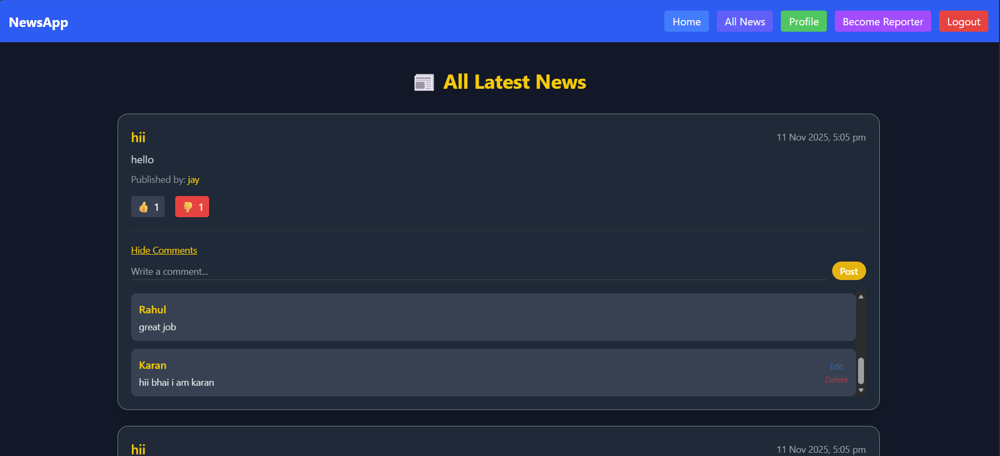
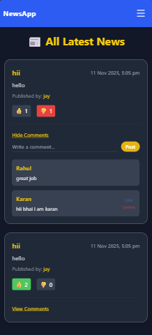
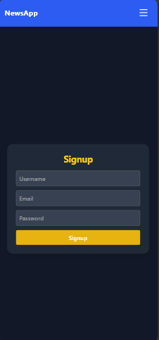
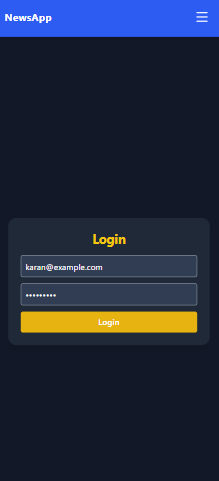

# 📰 Full-Stack News Portal (React + Spring Boot + MongoDB)

A production-ready **Full Stack News Application** where users can read, like/dislike, and comment, own comment also edit delete on news articles — while **reporters** can publish and manage news posts.

Built with **React (Vite + Tailwind CSS)** on frontend and **Spring Boot + MongoDB + JWT (HttpOnly cookies)** on backend.

---

## 🚀 Features

### 👤 Authentication & Roles
- Secure login & signup using **JWT (HttpOnly cookies)**
- Role-based access:
  - **USER:** Read, like/dislike, comment
  - **REPORTER:** Add, update, delete news

### 📰 News Management
- Reporters can **add, update, delete** their own news
- Users can **view all published news**
- Each article shows **author, date, likes, dislikes**

### 👍 Like / Dislike System
- Toggle like/dislike functionality per user
- Real-time like/dislike count updates
- Ensures only one reaction per user per post

### 💬 Comments System
- Add, edit, or delete comments
- View or hide comment section
- Auto-refresh after commenting

### ⚙️ Backend Highlights
- **Controller → Service → Repository → DTO** structure
- **Custom exception handling** (`CustomApiException`)
- **Spring Security + JWT** authentication
- MongoDB integration

### 🎨 Frontend Highlights
- Built using **React + Vite + Tailwind CSS**
- Clean, responsive UI for mobile & desktop
- Uses React Hooks: `useState`, `useEffect`, `useContext`
- Real-time API sync for likes/comments
- Secure API calls with `credentials: "include"`

---

## 🛠️ Tech Stack

| Layer | Technology |
|-------|-------------|
| **Frontend** | React, Vite, Tailwind CSS |
| **Backend** | Spring Boot, Spring Security, JWT |
| **Database** | MongoDB |
| **Language** | Java, JavaScript (ES6+) |
| **Build Tool** | Maven |
| **Version Control** | Git + GitHub |

---


---

## ⚙️ Setup Instructions

### 🧠 Backend Setup

1. Clone the repo
   ```bash
   git clone https://github.com/dibesh7381/full-stack-news-app-spring-boot
   cd full-stack-news-app-spring-boot/NewsApp

### 🧠 Frontend Setup
2. cd full-stack-news-app-spring-boot/frontend/pj

---

### Screenshots






---